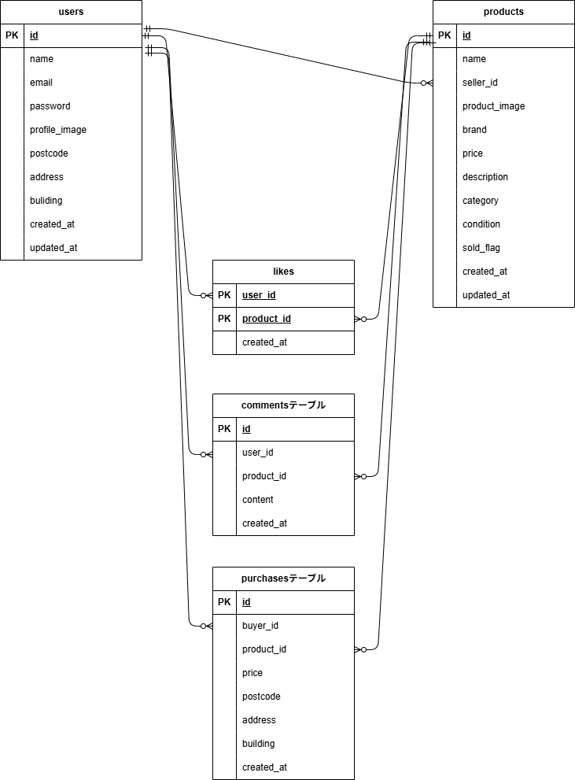

# フリマアプリ

## 環境構築

### Docker ビルド

- git clone git@github.com:takuichi01/flea-market.git
- docker-compose up -d --build

### Laravel 環境構築

1. docker-compose exec php bash
2. composer install
3. .env.example から.env を作成し、環境変数を変更
   - DB_HOST=mysql
   - DB_DATABASE=laravel_db
   - DB_USERNAME=laravel_user
   - DB_PASSWORD=laravel_pass
4. php artisan key:generate
5. php artisan migrate
6. php artisan db:seed

## 使用技術

- PHP:7.4.9
- Laravel:8.83.8
- MySQL:8.0.26

## ER 図

## URL
